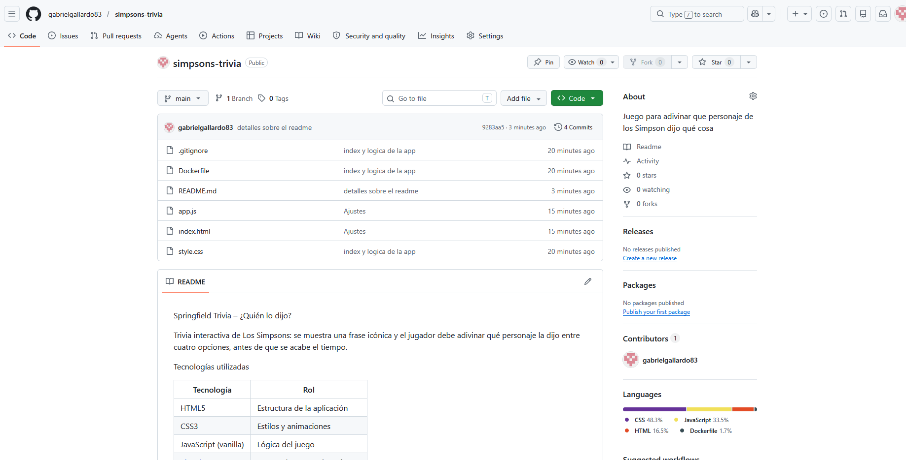
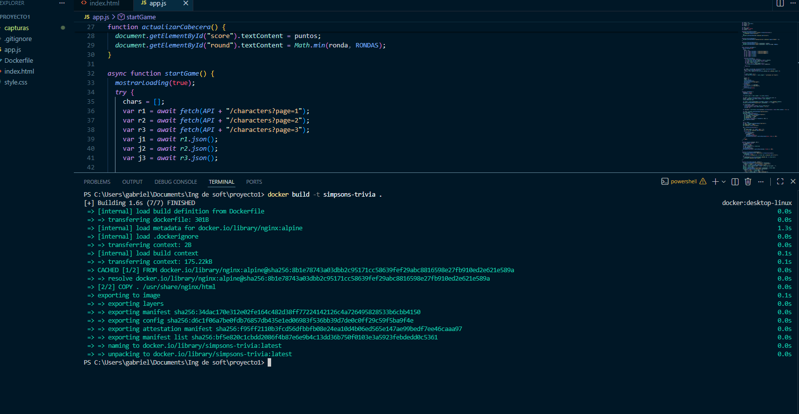
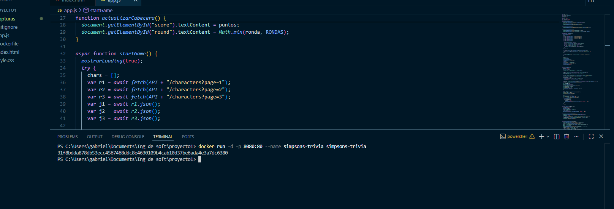
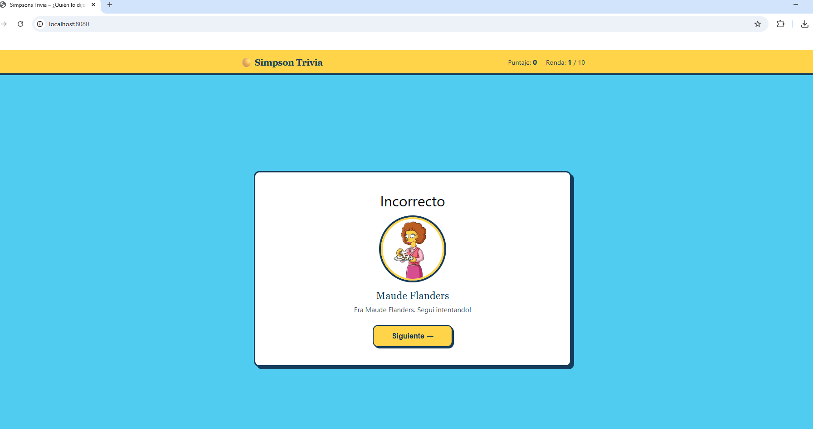

 Springfield Trivia – ¿Quién lo dijo?

Trivia interactiva de Los Simpsons: se muestra una frase icónica y el jugador debe adivinar qué personaje la dijo entre cuatro opciones, antes de que se acabe el tiempo.

 Tecnologías utilizadas

| Tecnología | Rol |
|------------|-----|
| HTML5 | Estructura de la aplicación |
| CSS3 | Estilos y animaciones |
| JavaScript (vanilla) | Lógica del juego |
| [The Simpsons API](https://thesimpsonsapi.com/) | Fuente de personajes y frases |
| Docker + nginx | Contenedor para servir la app |

Requisitos previos

- [Docker](https://www.docker.com/) instalado y corriendo
- Conexión a internet (para consumir la API en tiempo real)
- Navegador web moderno

 Estructura del proyecto

simpsons-trivia/

├── index.html      # Estructura principal
├── style.css       # Estilos
├── app.js          # Lógica del juego y consumo de API
├── Dockerfile      # Configuración del contenedor
├── .gitignore      # Archivos ignorados por Git
└── README.md       # Este archivo

 Pasos de instalación

 1. Clonar el repositorio

bash
git clone https://github.com/gabrielgallardo83/simpsons-trivia.git
cd simpsons-trivia

 Construcción de la imagen Docker

bash
docker build -t simpsons-trivia .

Ejecución del contenedor

bash
docker run -d -p 8080:80 --name simpsons-trivia simpsons-trivia

Luego abrí el navegador en:

http://localhost:8080

Para detener el contenedor:

bash
docker stop simpsons-trivia
docker rm simpsons-trivia

 Cómo jugar

1. Presioná **¡Empezar!**
2. Leé la frase que aparece en pantalla
3. Elegí el personaje correcto entre las 4 opciones antes de que se agote el tiempo (15 segundos)
4. Completá las 10 rondas y descubrí tu puntaje final

---

 API utilizada

**The Simpsons API** – [https://thesimpsonsapi.com](https://thesimpsonsapi.com)

- No requiere autenticación
- Endpoint usado: `GET /api/characters?page={n}`
- Devuelve personajes con nombre, imagen y frases

Capturas de pantalla

Repositorio publicado

 Construccion de la imagen

 Ejecucion del contenedor

 Aplicacion funcionando

Trabajo Práctico N°1 – Git y Docker  
Materia: Ing de Software  
Alumno: Gabriel Gallardo

